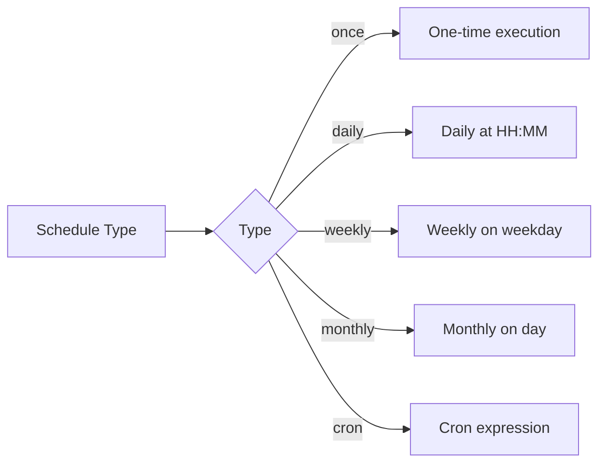
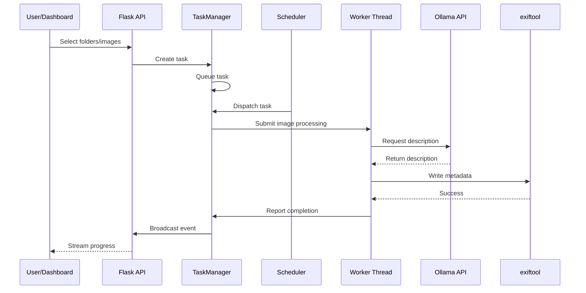

# TagHaul - Architectural Documentation

## Executive Summary

TagHaul is an AI-powered photo metadata tagging system that uses Ollama's `llava:13b` model to generate descriptive text for photos and writes them to multiple metadata fields (EXIF, XMP, IPTC) for use with Synology Photos, Windows Explorer, and macOS Finder.

The system provides both a **CLI workflow** and a **Flask web dashboard** with advanced features including:
- Multi-task scheduling with shared worker concurrency
- Server-Sent Events (SSE) for live progress streaming
- Scheduled batch processing with multiple schedule types
- Incremental processing with SQLite-based caching

---

## System Architecture Diagram

```mermaid
graph TB
    subgraph "Client Layer"
        Browser[Web Browser]
        CLI[CLI Tool]
    end

    subgraph "API Layer (Flask)"
        FlaskApp[Flask Application]
        APIRoutes[REST API Endpoints]
        SSE[Server-Sent Events]
    end

    subgraph "Task Manager"
        TaskManager[TaskManager Class]
        Scheduler[Scheduler Thread]
        WorkerPool[ThreadPoolExecutor]
    end

    subgraph "Backend Services"
        Ollama[Ollama API - llava:13b]
        Exiftool[exiftool CLI]
    end

    subgraph "Data Layer"
        SQLite[(SQLite Database)]
        Settings[JSON Settings]
    end

    subgraph "File System"
        PhotoRoot[/mnt/synology/photos]
        LogFiles[Log Files]
    end

    Browser --> FlaskApp
    CLI --> FlaskApp
    FlaskApp --> APIRoutes
    FlaskApp --> SSE
    APIRoutes --> TaskManager
    TaskManager --> Scheduler
    TaskManager --> WorkerPool
    WorkerPool --> Ollama
    WorkerPool --> Exiftool
    TaskManager --> SQLite
    TaskManager --> Settings
    Ollama --> PhotoRoot
    Exiftool --> PhotoRoot
    SQLite --> LogFiles
```

---

## Component Breakdown

### 1. Flask Application (`app.py`)

**Responsibilities:**
- REST API endpoint routing
- SSE event streaming
- Template rendering
- Environment variable configuration

**Key Features:**
- 30+ API endpoints for task management
- Health check endpoints
- Settings management (worker count)
- Scheduled batch management

**Endpoints:**
| Method | Path | Description |
|--------|------|-------------|
| GET | `/` | Dashboard home |
| GET | `/api/tree` | Directory listing |
| GET | `/api/health` | Health check |
| GET | `/api/settings` | Get worker settings |
| POST | `/api/settings` | Update worker count |
| POST | `/api/tasks` | Create new task |
| GET | `/api/tasks` | List all tasks |
| GET | `/api/tasks/<id>` | Get task details |
| POST | `/api/tasks/<id>/stop` | Stop running task |
| POST | `/api/tasks/<id>/resume` | Resume stopped task |
| DELETE | `/api/tasks/completed` | Clear completed tasks |
| GET | `/api/tasks/<id>/events` | SSE event stream |
| GET | `/api/scheduled-batches` | List scheduled batches |
| POST | `/api/scheduled-batches` | Create batch |
| PUT | `/api/scheduled-batches/<id>` | Update batch |
| DELETE | `/api/scheduled-batches/<id>` | Delete batch |
| POST | `/api/scheduled-batches/<id>/toggle` | Enable/disable batch |
| GET | `/api/scheduled-batches/<id>/history` | Batch execution history |
| POST | `/api/scheduled-batches/<id>/run-now` | Execute batch immediately |

### 2. Task Manager (`app.py` - TaskManager class)

**Responsibilities:**
- Task lifecycle management (create, queue, run, complete)
- Shared worker pool across all tasks
- SQLite database operations
- Event broadcasting via SSE

**Key Methods:**

```python
class TaskManager:
    def __init__(self, db_path, settings_path)
    def create_task(...) -> dict
    def get_task(task_id) -> dict
    def list_tasks() -> list
    def stop_task(task_id) -> dict
    def resume_task(task_id) -> dict
    def clear_completed()
    def attach_listener(task_id) -> (dict, queue.Queue)
    def detach_listener(task_id, listener)
    def create_scheduled_batch(...) -> dict
    def get_scheduled_batch(batch_id)
    def get_scheduled_batches(...)
    def update_scheduled_batch(batch_id, **updates)
    def delete_scheduled_batch(batch_id)
    def get_batch_history(batch_id)
    def execute_batch_now(batch_id)
```

**Concurrency Model:**
- Uses `ThreadPoolExecutor` with configurable max workers (1-4)
- Shared worker pool across all tasks
- Future-based task dispatch with timeout handling
- Round-robin task selection for fair scheduling

### 3. Backend Services (`tagger_backend.py`)

**Core Functions:**

| Function | Purpose |
|----------|---------|
| `iter_images(root)` | Walk directory tree, yield supported images |
| `expand_selection(root, paths)` | Expand file/directory paths to image list |
| `list_directory(root, path)` | List directory contents for explorer |
| `describe_image(path, model, prompt)` | Call Ollama API for description |
| `write_metadata(path, description)` | Write to EXIF/XMP/IPTC fields |
| `read_existing_metadata(path)` | Read current metadata |
| `has_existing_description(path)` | Check if description exists |
| `should_skip_file(conn, path, mtime)` | Determine if file should be skipped |
| `process_single_image(...)` | Process one image end-to-end |
| `process_image_paths(...)` | Process list of images |
| `process_images(...)` | Process all images in root |

**Skip Logic (Double Guard):**
1. Check SQLite cache (path + mtime)
2. Check existing metadata fields (Description, UserComment, ImageDescription, XPComment)

### 4. Scheduler (`scheduler.py`)

**ScheduleParser:**
- Calculates next run time for various schedule types
- Supports: `once`, `daily`, `weekly`, `monthly`, `cron`

**BatchScheduler:**
- Background thread that monitors scheduled batches
- Executes batches when their next_run_at time arrives
- Creates tasks via TaskManager for each batch execution

**Schedule Types:**



### 5. Database Schema

**SQLite Database (`indexing.db`):**

```mermaid
erDiagram
    TASKS ||--o{ PROCESSED_FILES : tracks
    BATCHES ||--o{ HISTORY : execution_history
    
    TASKS {
        text id PK
        text root
        text selected_paths JSON
        text model
        text prompt
        float temperature
        int dry_run
        text status
        int total
        int processed
        int skipped
        int errors
        int completed
        float avg_seconds
        text created_at
        text started_at
        text completed_at
    }
    
    PROCESSED_FILES {
        int id PK
        text file_path UK
        real mtime
        text processed_at
    }
    
    BATCHES {
        text id PK
        text name
        int enabled
        text schedule_type
        text schedule_value JSON
        text selected_paths JSON
        text model
        text prompt
        float temperature
        int dry_run
        text last_run_at
        text next_run_at
        text created_at
        text updated_at
        text tags JSON
        text notifications JSON
    }
    
    HISTORY {
        text id PK
        text batch_id FK
        text task_id FK
        text started_at
        text completed_at
        text status
        text summary JSON
    }
```

### 6. Data Flow



---

## Configuration

### Environment Variables

| Variable | Default | Description |
|----------|---------|-------------|
| `PHOTO_TAGGER_DASHBOARD_ROOT` | `/mnt/synology/photos` | Photo directory root |
| `PHOTO_TAGGER_DB_PATH` | `./indexing.db` | SQLite database path |
| `PHOTO_TAGGER_SETTINGS_PATH` | `./tagger_settings.json` | Settings file path |
| `PHOTO_TAGGER_HOST` | `0.0.0.0` | Flask host |
| `PHOTO_TAGGER_PORT` | `5000` | Flask port |
| `PHOTO_TAGGER_MAX_WORKERS` | `2` | Max parallel workers |
| `OLLAMA_HOST` | `http://host.docker.internal:11434` | Ollama endpoint |

### Settings File (`tagger_settings.json`)

```json
{
  "max_workers": 2,
  "ollama_host": "http://host.docker.internal:11434",
  "ollama_model": "llava:13b",
  "ollama_prompt": "Describe this photo in 1-2 sentences...",
  "ollama_temperature": 0.2
}
```

---

## API Reference

### Task Management

#### Create Task
```json
POST /api/tasks
{
  "paths": ["album1", "album2"],
  "root": "/mnt/synology/photos",
  "model": "llava:13b",
  "temperature": 0.2,
  "dry_run": false,
  "prompt": "Custom prompt"
}
```

#### Get Task
```json
GET /api/tasks/<id>
{
  "id": "uuid",
  "status": "running",
  "total": 150,
  "processed": 45,
  "skipped": 10,
  "errors": 0,
  "eta_seconds": 120,
  "avg_seconds": 2.5,
  "selected_paths": ["album1", "album2"],
  "model": "llava:13b",
  "prompt": "...",
  "temperature": 0.2
}
```

#### Stop Task
```json
POST /api/tasks/<id>/stop
{
  "status": "stopped",
  "processed": 45,
  "skipped": 10,
  "errors": 0
}
```

### Scheduled Batches

#### Create Batch
```json
POST /api/scheduled-batches
{
  "name": "Daily Night Scan",
  "schedule_type": "daily",
  "schedule_value": {
    "time": "02:00",
    "days": [0, 2, 4]
  },
  "selected_paths": ["album1", "album2"],
  "model": "llava:13b",
  "temperature": 0.2,
  "dry_run": false,
  "tags": ["night", "auto"],
  "prompt": "Custom prompt"
}
```

#### Get Batch
```json
GET /api/scheduled-batches/<id>
{
  "id": "uuid",
  "name": "Daily Night Scan",
  "schedule_type": "daily",
  "schedule_value": {...},
  "selected_paths": [...],
  "model": "llava:13b",
  "temperature": 0.2,
  "dry_run": false,
  "tags": ["night", "auto"],
  "last_run_at": "2026-04-26T02:00:00",
  "next_run_at": "2026-04-28T02:00:00"
}
```

---

## Event System (SSE)

### Event Types

| Event | Payload | Description |
|-------|---------|-------------|
| `start` | `{total, current}` | Task started |
| `processing` | `{path}` | Processing image |
| `describe` | `{path, description}` | Description generated |
| `written` | `{path, description, current}` | Metadata written |
| `skip` | `{path, skip_reason}` | File skipped |
| `error` | `{path, message}` | Processing error |
| `stopped` | `{status, stats}` | Task stopped |
| `complete` | `{status, stats}` | Task completed |
| `snapshot` | `{task}` | Full task snapshot |

### SSE Endpoint

```
GET /api/tasks/<id>/events
```

---

## Security Considerations

1. **Path Traversal Prevention:**
   - All paths resolved and validated against root
   - `resolve_relative_path()` prevents directory escape

2. **Concurrency Safety:**
   - SQLite transactions with proper locking
   - Thread-safe worker pool
   - Event queue for broadcasting

3. **Error Handling:**
   - Try-except blocks throughout
   - Graceful degradation on Ollama failure
   - Comprehensive logging

---

## Performance Characteristics

### Concurrency
- **Max Workers:** 1-4 (configurable)
- **Shared Pool:** All tasks share same worker pool
- **Fair Scheduling:** Round-robin task selection

### Caching
- **SQLite Cache:** Stores processed file paths + mtime
- **Metadata Check:** Reads existing metadata before processing
- **Double Guard:** Prevents duplicate processing

### Throughput
- **Typical:** 1-2 images/second per worker
- **Total:** 2-8 images/second with 2-4 workers
- **ETA Calculation:** Based on average processing time

---

## Deployment

### Docker

```dockerfile
FROM python:3.12-slim

RUN apt-get update && apt-get install -y libimage-exiftool-perl

WORKDIR /app
COPY requirements.txt ./
RUN pip install --no-cache-dir -r requirements.txt

COPY . .
RUN mkdir -p /data

ENV PHOTO_TAGGER_DB_PATH=/data/indexing.db \
    PHOTO_TAGGER_SETTINGS_PATH=/data/tagger_settings.json \
    PHOTO_TAGGER_DASHBOARD_ROOT=/mnt/synology \
    PHOTO_TAGGER_HOST=0.0.0.0 \
    PHOTO_TAGGER_PORT=5000 \
    PHOTO_TAGGER_MAX_WORKERS=2

VOLUME ["/data"]
EXPOSE 5000
CMD ["python", "app.py"]
```

### Environment Variables

```bash
export PHOTO_TAGGER_DASHBOARD_ROOT=/mnt/synology/photos
export PHOTO_TAGGER_DB_PATH=/data/indexing.db
export PHOTO_TAGGER_MAX_WORKERS=2
export OLLAMA_HOST=http://host.docker.internal:11434
```

---

## Troubleshooting

### Common Issues

1. **Ollama Connection Failed:**
   - Check `OLLAMA_HOST` environment variable
   - Verify Ollama is running
   - Check network connectivity

2. **exiftool Not Found:**
   - Install: `apt-get install libimage-exiftool-perl`
   - Or use Docker image with exiftool

3. **SQLite Lock Issues:**
   - Check for zombie processes
   - Restart application
   - Verify database file permissions

4. **Worker Pool Exhaustion:**
   - Increase `PHOTO_TAGGER_MAX_WORKERS`
   - Check Ollama API rate limits

---

## Future Enhancements

1. **Batch Size Configuration:**
   - Allow per-batch image count limits
   - Prevent overwhelming Ollama API

2. **Retry Logic:**
   - Exponential backoff for transient failures
   - Automatic retry on Ollama timeout

3. **Metadata Validation:**
   - Validate generated descriptions
   - Character limit enforcement

4. **Notification System:**
   - Email notifications on completion
   - Push notifications for critical batches

5. **Statistics Dashboard:**
   - Processing speed graphs
   - Error rate tracking
   - Model performance metrics

---

## License

MIT License - See LICENSE file for details.

---

## Support

For issues and feature requests, please open an issue on the project repository.
